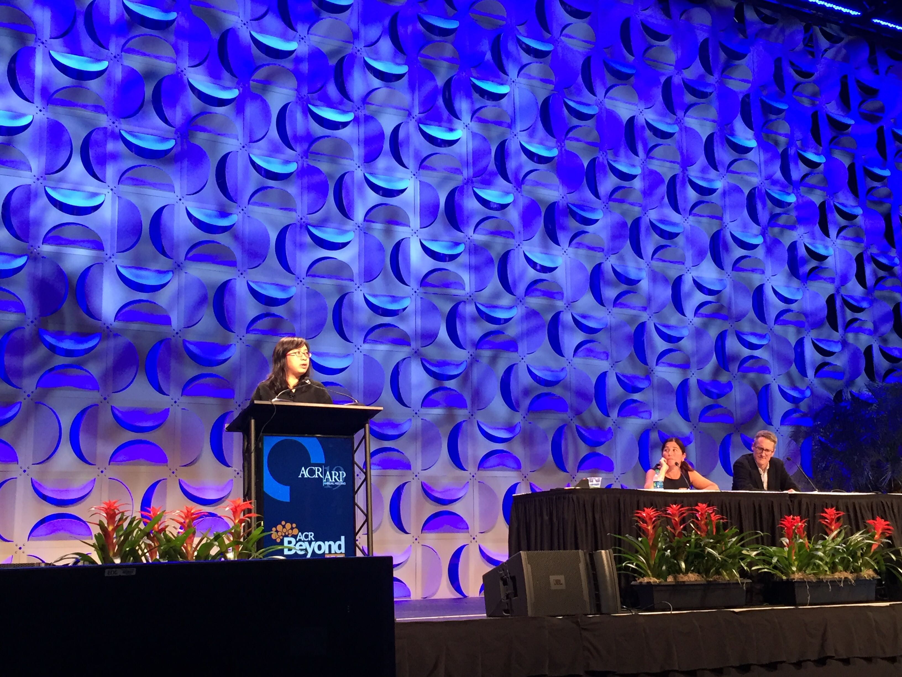

Glad to give an talk on [Integration of Single Cells from Inflammatory Disease Tissues Reveals Common and Unique Pathogenic Cell States](https://acrabstracts.org/abstract/integration-of-single-cells-from-inflammatory-disease-tissues-reveals-common-and-unique-pathogenic-cell-states/) and an talk of "System-level multi-modality data integration for AMP RA phase II" at the AMP session at Atlanta, GA.

Photo credit: Dr. Anna Helena Jonsson

