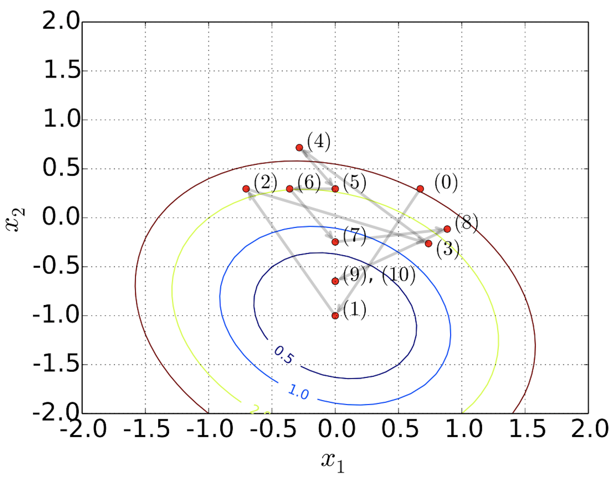

+++
title = "A global optimization algorithm for sparse mixed-membership matrix factorization. ICSA Book Series in Statistics. Springer, Cham, 2019"
date = 2019-07-01T00:00:00

# Authors. Comma separated list, e.g. `["Bob Smith", "David Jones"]`.
authors = ["**Zhang, F.**", "Wang, C.", "Trapp, A.", "Flaherty, P."]

# Publication type.
# Legend:
# 0 = Uncategorized
# 1 = Conference paper
# 2 = Journal article
# 3 = Manuscript
# 4 = Report
# 5 = Book
# 6 = Book section
publication_types = ["6"]

# Publication name and optional abbreviated version.
publication = "In *ICSA Book Series in Statistis, Springer, Cham*"
publication_short = ""

# Abstract.
abstract = "Mixed membership factorization is a popular approach for analyzing data sets that have within-sample heterogeneity. In recent years, several algorithms have been developed for mixed membership matrix factorization, but they only guarantee estimates from a local optimum. Here, we derive a global optimization (GOP) algorithm that provides a guaranteed -global optimum for a sparse mixed membership matrix factorization problem. We test the algorithm on simulated data and find the algorithm always bounds the global optimum across random initializations and explores multiple modes efficiently."

# Summary
summary = "Global optimization, benders decomposition, mixed membership matrix factorization"

# Digital Object Identifier (DOI)
doi = "https://doi.org/10.1007/978-3-030-15310-6_7"

# Is this a featured publication? (true/false)
featured = true

# Tags (optional).
#   Set `tags = []` for no tags, or use the form `tags = ["A Tag", "Another Tag"]` for one or more tags.
tags = []

# Projects (optional).
#   Associate this publication with one or more of your projects.
#   Simply enter your project's folder or file name without extension.
#   E.g. `projects = ["deep-learning"]` references 
#   `content/project/deep-learning/index.md`.
#   Otherwise, set `projects = []`.
projects = ["internal-project"]

# Links (optional).
url_pdf = "https://rd.springer.com/chapter/10.1007/978-3-030-15310-6_7"
url_preprint = "https://arxiv.org/pdf/1610.06145.pdf"
url_code = "https://github.com/fzhangcode/global_optimization"
# url_dataset = "#"

# Custom links (optional).
#   Uncomment line below to enable. For multiple links, use the form `[{...}, {...}, {...}]`.
# links = [{name = "Pubmed Link", url = ""}]

# Does this page contain LaTeX math? (true/false)
math = true

# Featured image
# To use, add an image named `featured.jpg/png` to your page's folder. 
[image]
# 
  # Caption (optional)
  # caption = "Image credit: [**Unsplash**](https://unsplash.com/photos/pLCdAaMFLTE)"

  # Focal point (optional)
  # Options: Smart, Center, TopLeft, Top, TopRight, Left, Right, BottomLeft, Bottom, BottomRight
  focal_point = ""
  
# Featured image
# Place your image in the `static/img/` folder and reference its filename below, e.g. `image = "example.jpg"`.
[header]
image = "headers/gop_converg.png"
# caption = "My caption :smile:" 

+++

